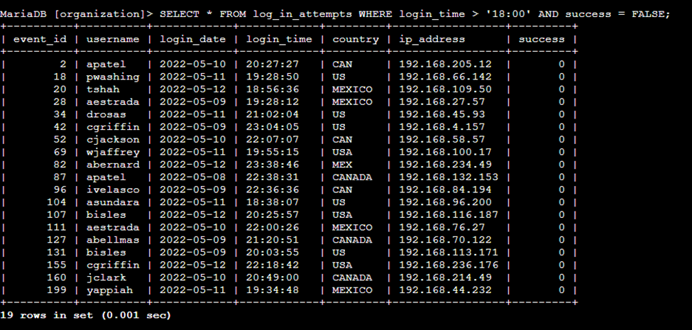
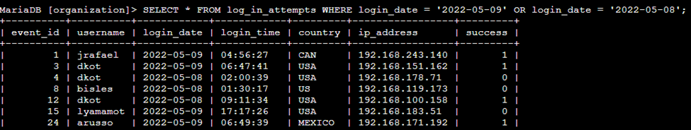
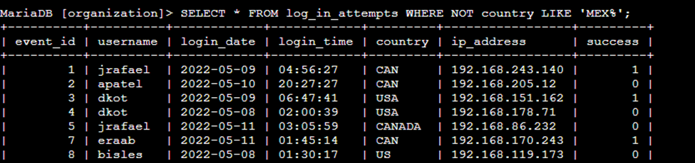
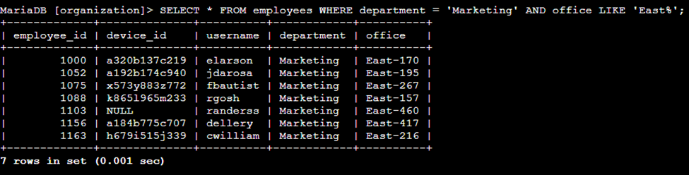
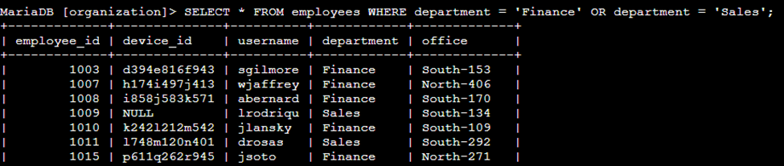
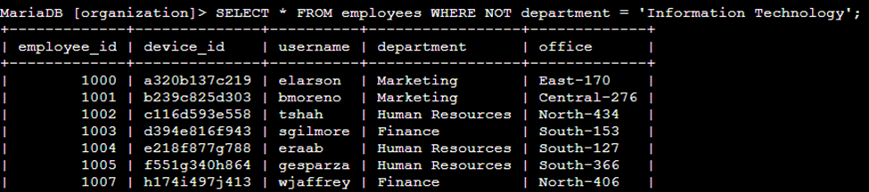

# Análisis y desarrollo

## Aplicando filtros a consultas SQL

### Descripción del proyecto

Este proyecto está orientado a mejorar la seguridad de un sistema. Dentro de las principales actividades de mi trabajo, se encuentra el poder garantizar la seguridad del sistema, investigando posibles problemas de seguridad y actualizar los ordenadores de los empleados según sea necesario. En los siguientes pasos, muestro cómo utilicé y apliqué SQL con filtros para realizar tareas relacionadas con la seguridad.

---

#### Paso 1: Recuperar intentos fallidos de inicio de sesión después del horario

Se produjo un posible incidente de seguridad fuera del horario laboral (después de las 18:00). Es necesario investigar todos los intentos de inicio de sesión fallidos ocurridos fuera de este horario.

El siguiente código muestra cómo utilicé una consulta SQL para filtrar los intentos de inicio de sesión fallidos ocurridos fuera del horario laboral.

La primera línea de la captura de pantalla es mi consulta, y luego una parte de la tabla con el resultado de mi consulta. Esta consulta filtra los intentos de inicio de sesión fallidos que ocurrieron después de las 18:00.

Primero, comencé seleccionando todos los datos de la tabla **log_in_attempts**. Luego, usé una cláusula **WHERE** con un operador **AND** para filtrar mis resultados y mostrar solo los intentos de inicio de sesión que ocurrieron después de las 18:00 y no fueron exitosos. La primera condición es **login_time > '18:00'**, que filtra los intentos de inicio de sesión que ocurrieron después de las 18:00. La segunda condición es **success = FALSE**, que filtra los intentos de inicio de sesión fallidos (también se puede escribir el valor de 0, puesto que **TRUE = 1** y **FALSE = 0** de los valores booleanos en consultas).

---

#### Paso 2: Recuperar intentos de inicio de sesión en fechas específicas

El 9 de mayo de 2022 se produjo un evento sospechoso. Se debe investigar cualquier intento de inicio de sesión ocurrido ese día o el día anterior.

El siguiente código muestra que utilicé una consulta SQL para filtrar los intentos de inicio de sesión ocurridos en fechas específicas.

La primera línea de la captura de pantalla es mi consulta, y lo siguiente es un fragmento del resultado a mi consulta. Esta consulta devuelve todos los intentos de inicio de sesión que ocurrieron el 9 o el 8 de mayo de 2022.

Primero, he seleccionado todos los datos de la tabla **log_in_attempts**. Luego, usé una cláusula **WHERE** con un operador **OR** para filtrar mis resultados y mostrar solo los intentos de inicio de sesión que ocurrieron el 9 o el 8 de mayo de 2022. La primera condición es **login_date = '2022-05-09'**, que filtra los inicios de sesión del 9 de mayo de 2022. La segunda condición es **login_date = '2022-05-08'**, que filtra los inicios de sesión del 8 de mayo de 2022.

---

#### Paso 3: Recuperar intentos de inicio de sesión fuera de México

Tras analizar los datos de la organización sobre intentos de inicio de sesión, creo que existe un problema con los intentos ocurridos fuera de México. Estos intentos deben investigarse.

Aplico un código para una consulta SQL filtrando los intentos de inicio de sesión ocurridos fuera de México.

La primera línea de la captura de pantalla muestra mi consulta, y seguido, una porción del resultado. Esta consulta devuelve todos los intentos de inicio de sesión ocurridos en países distintos de México.

Primero, seleccioné todos los datos de la tabla **log_in_attempts**. Luego, utilicé una cláusula **WHERE** con **NOT** para filtrar los países que no son México, es decir, todos los demás países. Usé **LIKE** con **MEX%** como patrón de coincidencia, ya que el conjunto de datos representa a México como MEX y MEXICO. El signo de porcentaje (**%**) representa cualquier número de caracteres no especificados cuando se usa con **LIKE**.

---

#### Paso 4: Recuperar empleados en Marketing

Se requiere actualizar los ordenadores de algunos empleados del departamento de Marketing. Para ello, necesito información sobre qué equipos actualizar.

En el siguiente código muestro cómo utilizo una consulta SQL para filtrar los equipos de los empleados del departamento de Marketing en el edificio “Este”.

La primera línea de la captura de pantalla es mi consulta, y lo siguiente es el resultado. Esta consulta devuelve todos los empleados del departamento de Marketing en el edificio “Este”.

Primero, comencé seleccionando todos los datos de la tabla **employees**. Luego, utilicé una cláusula **WHERE** con **AND** para filtrar a los empleados que trabajan en el departamento de **Marketing** y en el edificio “Este”. Utilicé **LIKE** con **East%** como patrón de coincidencia porque los datos en la columna de oficina representan el edificio “Este” con el número de oficina específico. La primera condición es la parte **department = 'Marketing'**, que filtra a los empleados del departamento de Marketing. La segunda condición es la parte office **LIKE 'East%'**, que filtra a los empleados del edificio “Este”.

---

#### Paso 5: Recuperar empleados en Finanzas o Ventas

También es necesario actualizar los equipos de los empleados de los departamentos de Finanzas y Ventas. Dado que se requiere una actualización de seguridad diferente, debo obtener información únicamente de los empleados de estos dos departamentos.

Entonces, en el siguiente código muestro cómo uso una consulta SQL para filtrar los equipos de los empleados de los departamentos de Finanzas o Ventas.

La primera línea de la captura de pantalla es mi consulta, y seguidamente se muestra una parte del resultado. Esta consulta devuelve todos los empleados de los departamentos de Finanzas y Ventas.

Primero, seleccioné todos los datos de la tabla **employees**. Luego, utilicé una cláusula **WHERE** con **OR** para filtrar a los empleados que pertenecen a los departamentos de **Finanzas** y **Ventas**. Utilicé el operador **OR** en lugar de **AND** porque quiero todos los empleados que pertenecen a cualquiera de los dos departamentos. La primera condición es **department = 'Finance'**, que filtra a los empleados del departamento de Finanzas. La segunda condición es **department = 'Sales'**, que filtra a los empleados del departamento de Ventas.

---

#### Paso 6: Recuperar a todos los empleados que no estén en TI

Se necesita realizar una actualización de seguridad adicional en los equipos de los empleados que **no pertenecen** al departamento de **Tecnologías de la Información**. Para ello, primero debo obtener información sobre estos empleados.

A continuación, muestro cómo utilicé una consulta SQL para filtrar los equipos de los empleados que no pertenecen al departamento de “Tecnologías de la Información”.

La primera línea de la captura de pantalla es mi consulta, y luego es una porción del resultado. La consulta devuelve todos los empleados que no pertenecen al departamento de “Tecnologías de la Información”.

Primero, comencé seleccionando todos los datos de la tabla **employees**. Luego, utilicé una cláusula **WHERE** con **NOT** para filtrar a los empleados que no pertenecen a este departamento, es decir, que muestre a todos los demás.

---

### Resumen

- Apliqué filtros a las consultas SQL para obtener **información específica** sobre los intentos de inicio de sesión y las máquinas de los empleados.
- Utilicé dos tablas diferentes: **log_in_attempts** y **employees**.
- Utilicé los operadores **AND**, **OR** y **NOT** para filtrar la información específica necesaria para cada tarea.
- También utilicé **LIKE** y el comodín de porcentaje (**%**) para filtrar patrones.

---

#### Descarga el proyecto en PDF

[Aplicando filtros a consultas SQL | Gabriel Ternero](docs/Aplicando_filtros_a_consultas_SQL.pdf) 👈
