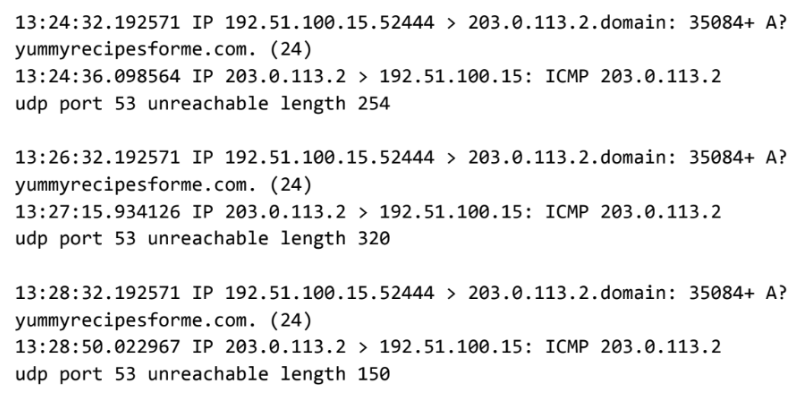

# Indicaciones del proyecto

## Objetivo de la actividad

En esta actividad, analizará el tráfico DNS e ICMP en tránsito utilizando los datos de una herramienta de análisis de protocolos de red. Identificará qué protocolo de red se utilizó en la evaluación del incidente de ciberseguridad.

En la capa de Internet del Modelo TCP/IP, la IP formatea los paquetes de datos en datagramas IP. La información proporcionada en el datagrama de un paquete IP puede ofrecer a los analistas de seguridad una visión de los paquetes de datos sospechosos en tránsito.

Saber cómo identificar el tráfico potencialmente malicioso en una red puede ayudar a los analistas de ciberseguridad a evaluar los riesgos de seguridad en una red y a reforzar la seguridad de la misma.

## Escenario

Usted es un analista de ciberseguridad que trabaja en una empresa especializada en la prestación de servicios informáticos para clientes. Varios clientes de clientes informaron de que no podían acceder al sitio web de la empresa cliente `www.yummyrecipesforme.com`, y vieron el error "puerto de destino inalcanzable" después de esperar a que se cargara la página.

Usted tiene la tarea de analizar la situación y determinar qué protocolo de red se vio afectado durante este incidente. Para empezar, intenta visitar la página web y también recibe el error "puerto de destino inalcanzable" Para solucionar el problema, carga su herramienta de análisis de red, `tcpdump`, e intenta cargar de nuevo la página web. Para cargar la página web, su navegador envía una consulta a un servidor DNS a través del protocolo UDP para recuperar la dirección IP del nombre de dominio del sitio web; esto forma parte del protocolo DNS. A continuación, su navegador utiliza esta dirección IP como IP de destino para enviar una solicitud HTTPS al servidor web para mostrar la página web El analizador muestra que cuando envía paquetes UDP al servidor DNS, recibe paquetes ICMP que contienen el mensaje de error: "Puerto udp 53 inalcanzable".

En el registro `tcpdump`, se encuentra la siguiente información:

1. Las dos primeras líneas del archivo de registro muestran la petición saliente inicial de su ordenador al servidor DNS solicitando la dirección IP de `yummyrecipesforme.com`. Esta solicitud se envía en un Paquete UDP.
2. La tercera y cuarta líneas del registro muestran la respuesta a su paquete UDP. En este caso, la línea ICMP 203.0.113.2 es el inicio del mensaje de error que indica que el paquete UDP no se pudo entregar en el puerto 53 del servidor DNS.
3. Delante de cada solicitud y respuesta, encontrará marcas de tiempo que indican cuándo se produjo el incidente. En el registro, ésta es la primera secuencia de números que aparece: 13:24:32.192571. Esto significa que la hora es 13:24, 32,192571 segundos.
4. Después de las marcas de tiempo, encontrará las direcciones IP de origen y destino. En la primera línea, donde el paquete UDP viaja desde su navegador hasta el servidor DNS, esta información se muestra como: 192.51.100.15 > 203.0.113.2.dominio. La dirección IP a la izquierda del símbolo mayor que (>) es la dirección de origen, que en este ejemplo es la dirección IP de su ordenador. La dirección IP a la derecha del símbolo mayor que (>) es la dirección IP de destino. En este caso, es la dirección IP del servidor DNS: 203.0.113.2.dominio. Para la respuesta de error ICMP, la dirección de origen es 203.0.113.2 y el destino es la dirección IP de su ordenador 192.51.100.15.
5. Después de las direcciones IP de origen y destino, puede haber una serie de detalles adicionales como el protocolo, el número de puerto de origen y las banderas. En la primera línea del registro de errores, el número de identificación de la consulta aparece como: 35084. El signo más después del número de identificación de la consulta indica que hay banderas asociadas al mensaje UDP. La "A?" indica una bandera asociada con la solicitud DNS de un registro A, donde un registro A mapea un nombre de dominio a una dirección IP. La tercera línea muestra el protocolo del mensaje de respuesta al navegador: "ICMP", al que sigue un mensaje de error ICMP.
6. El mensaje de error, "puerto udp 53 inalcanzable" se menciona en la última línea. Puerto 53 es un puerto para el servicio DNS. La palabra "inalcanzable" en el mensaje indica que el mensaje UDP que solicitaba una dirección IP para el dominio `www.yummyrecipesforme.com` no llegó al servidor DNS porque no había ningún servicio escuchando en el puerto DNS receptor.
7. Las líneas restantes del registro indican que se enviaron paquetes ICMP dos veces más, pero en ambas ocasiones se recibió el mismo error de entrega.

Ahora que ha capturado los paquetes de datos utilizando una herramienta de análisis de red, su trabajo consiste en identificar qué protocolo de red y qué servicio se vieron afectados por este incidente. A continuación, deberá redactar un informe de seguimiento.

Como analista, puede inspeccionar el tráfico de red y los datos de red para determinar qué está causando los problemas relacionados con la red durante los incidentes de ciberseguridad. Más adelante en este curso, demostrará cómo gestionar y resolver incidentes. Por ahora, sólo necesita analizar la situación.

Mientras tanto, este incidente está siendo gestionado por ingenieros de seguridad después de que usted y otros analistas hayan informado del problema a su supervisor directo.

## Instrucciones paso a paso

Siga las instrucciones y responda a la pregunta siguiente para completar la actividad.

### Paso 1: Acceder a la plantilla

Para utilizar la plantilla para este tema del curso.

[Informe-de-incidente-de-ciberseguridad-Análisis-de-tráfico-de-red.pdf](docs/Informe-de-incidente-de-ciberseguridad-Anlisis-de-trfico-de-red.pdf)

[Cybersecurity-incident-report-Network-traffic-analysis.pdf](docs/Cybersecurity-incident-report-Network-traffic-analysis.pdf)

Utilice los iniciadores de frases y las indicaciones de la plantilla para apoyar su reflexión y asegúrese de incluir todos los detalles relevantes sobre el incidente.

### Paso 2: Acceda a los materiales de apoyo

Los siguientes materiales de apoyo le ayudarán a completar esta actividad. Manténgalos abiertos mientras avanza hacia los siguientes pasos.

Para utilizar los materiales de apoyo para este tema del curso, haga clic en los siguientes enlaces.

[Ejemplo de un informe de incidente de ciberseguridad.pdf](docs/Ejemplo_de_un_informe_de_incidente_de_ciberseguridad.pdf)

[Example-of-a-Cybersecurity-Incident-Report.pdf](docs/Example-of-a-Cybersecurity-Incident-Report.pdf)

### Paso 3: Proporcione un resumen del problema encontrado en el registro `tcpdump`

Tras analizar los datos que le presenta el registro `tcpdump`, identifique tendencias en los datos. Evalúe qué protocolo está produciendo el mensaje de error del servidor DNS para el sitio web `yummyrecipesforme.com`. Recuerde que uno de los puertos que se muestra repetidamente es el Puerto 53, comúnmente utilizado para DNS. En su análisis

- Incluya un breve resumen del análisis del registro `tcpdump` e identifique qué protocolos se utilizaron para el Tráfico de red.
- Proporcione algunos detalles sobre lo indicado en el registro.
- Interprete los problemas encontrados en el registro.

Registre sus respuestas en la primera parte del informe sobre incidentes de ciberseguridad.

### Paso 4: Explique su análisis de los datos y proporcione una solución para aplicar

Ahora que ha inspeccionado el registro de tráfico y ha identificado las tendencias en el tráfico, describa por qué aparecieron los mensajes de error en el registro. Utilice su respuesta del paso anterior y el escenario para identificar la razón de los mensajes de error ICMP. Los mensajes de error indican que hay un problema con un puerto específico. ¿Qué revelan los diferentes protocolos implicados en el registro sobre la incidencia? En su respuesta:

- Indique cuándo se informó del problema por primera vez.
- Proporcione el escenario, los eventos y los síntomas identificados cuando se informó del incidente por primera vez.
- Explique el estado actual del problema.
- Describa la información descubierta al investigar el problema hasta este momento.
- Enumere los siguientes pasos para solucionar y resolver el problema.
- Proporcione la presunta causa raíz del problema.

Registre sus respuestas en la segunda parte del informe sobre incidentes de ciberseguridad.

## Qué incluir en su respuesta

Asegúrese de abordar los siguientes puntos en su actividad completada:

- Proporcione un resumen del problema encontrado en el registro `tcpdump`
- Explique su análisis de los datos y proporcione una posible causa del incidente
