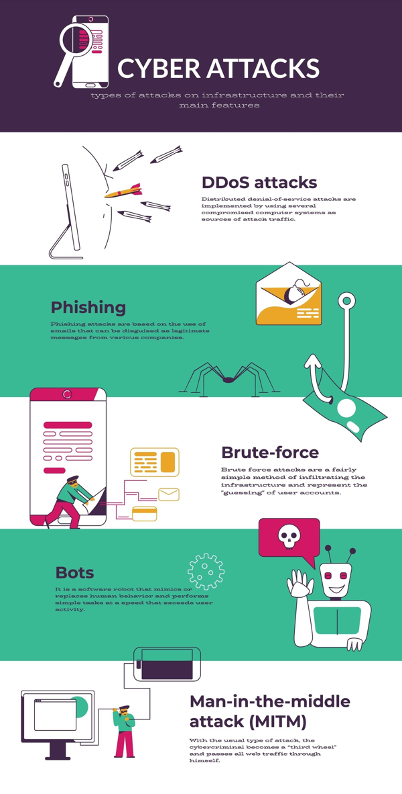

# Análisis y desarrollo

En este proyecto estaremos uniendo **el análisis técnico de red** con **la gestión de accesos**. Muy interesante, porque aquí pasamos de simplemente "mirar la red" a entender cómo una debilidad en el **sistema operativo** (una contraseña por defecto) permitió que todo el desastre ocurriera.

Ahora desarrollemos este análisis:

## Informe de Incidente de Ciberseguridad: yummyrecipesforme.com

### Sección 1: Identificación del protocolo de red

Luego de revisar el registro de tráfico de `tcpdump`, he identificado los siguientes protocolos clave involucrados en la comunicación:

- **DNS (Domain Name System):** Se utiliza al inicio para que el navegador del usuario encuentre la dirección IP del servidor tanto de la web original como de la maliciosa.
- **TCP (Transmission Control Protocol):** Es el protocolo de transporte que permite establecer la conexión segura y fiable entre el cliente y el servidor mediante el **saludo de tres vías** (Flags [S], [S.] y [.]).
- **HTTP (Hypertext Transfer Protocol):** Es el protocolo de la capa de aplicación utilizado para solicitar y transmitir los datos de la página web (mediante el método `GET`) y, en este caso, para descargar el archivo malicioso.

---

### Sección 2: Documentación del incidente

**Resumen de los hechos:** El incidente comenzó cuando un antiguo empleado descontento realizó un **ataque de fuerza bruta** contra el panel de administración del host de `yummyrecipesforme.com`. Debido a que la cuenta administrativa conservaba una **contraseña por defecto**, el atacante logró entrar fácilmente. Una vez dentro, modificó el código fuente inyectando un script de **Javascript** y cambió la contraseña para bloquear al propietario legítimo.

**Cómo se descubrió:** Varios clientes informaron al servicio de soporte que el sitio les pedía descargar un archivo ejecutable sospechoso para "actualizar el navegador". Los afectados notaron que, tras ejecutarlo, eran redirigidos a otra dirección (`greatrecipesforme.com`) y sus equipos se volvían extremadamente lentos.

**Evidencias técnicas:**

- **Análisis del código:** Se confirmó la presencia de Javascript malicioso que forzaba la descarga de un ejecutable.
- **Registros de red (tcpdump):** El log muestra que, posterior a cargar la página inicial, se inicia una petición DNS para una URL distinta y el tráfico se desvía automáticamente a una IP desconocida (`192.0.2.17`).

---

### Sección 3: Recomendaciones de seguridad (Endurecimiento)

Para evitar que un ataque de fuerza bruta vuelva a comprometer el sistema, recomiendo encarecidamente la siguiente medida:

**Implementación de Autenticación de Dos Factores (2FA)**:

- **¿Por qué es eficaz?:** Aunque un atacante logre adivinar o robar la contraseña (incluso si es una por defecto), el **2FA** añade una capa extra de seguridad. El sistema solicitará un segundo código (enviado al móvil o generado por una app) que solo el dueño legítimo posee. Esto hace que conocer la contraseña no sea suficiente para entrar al panel de administración.

**Otras medidas complementarias sugeridas:**

1. **Limitar el número de intentos de inicio de sesión:** Bloquear automáticamente la cuenta o la dirección IP tras 3 o 5 intentos fallidos.
2. **Política de contraseñas robustas:** Obligar a cambiar la contraseña por defecto inmediatamente y exigir que la nueva sea compleja (mínimo 12 caracteres, símbolos y números).

---

## Reflexión

> *"Con este caso he aprendido que la seguridad no es solo técnica (analizar logs), sino también va de gestión, es decir, cómo una simple contraseña por defecto anuló todas las protecciones de red, tan simple como eso. Por tal motivo el endurecimiento de sistemas (**Hardening**) es la base para que el monitoreo de red sea efectivo"*. ☝️😉

[Informe-Ataque-de-fuerza-bruta-Gabriel-Ternero.pdf](docs/Informe-Ataque-de-fuerza-bruta-Gabriel-Ternero.pdf)

