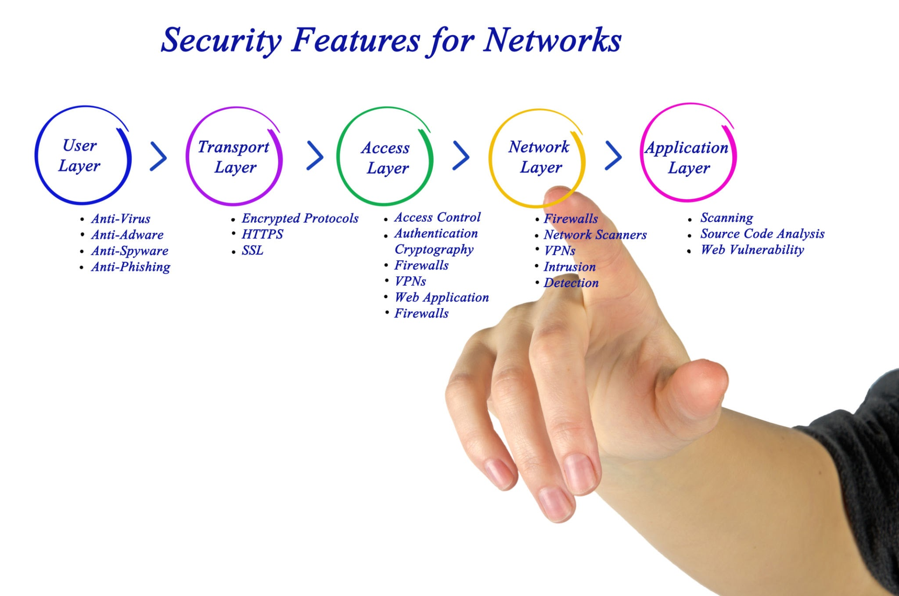
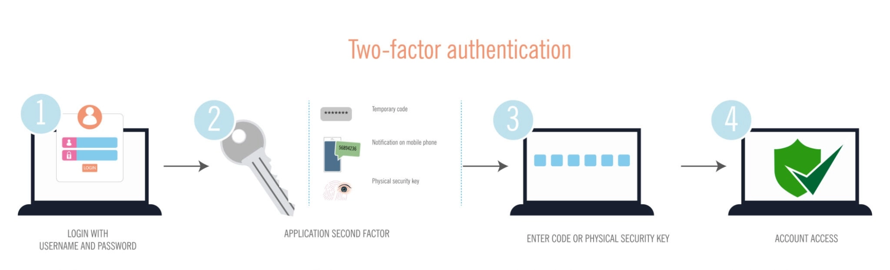

# Análisis y desarrollo

En este proyecto pasamos de analizar logs a implementar capas de seguridad en toda la infraestructura.

## ¿Por qué es esto tan importante?

Imaginemos que la red es un castillo. El **Hardening** no es solo poner un “guardia en la puerta” (Firewall), es también cerrar las ventanas/puertas que no se usan (Puertos), encriptar los mensajes que se envían entre los caballeros (Cifrado) y tener un plano completo del castillo para saber si alguien movió una piedra de lugar (Línea base), en resumen, **tener un mayor control cubriendo diferentes capas de seguridad**.

Tener esta mentalidad de "defensa en profundidad" es lo que hace que un analista de seguridad pase de ser alguien que "reacciona" a alguien que "previene". Comencemos! 🫵😎💫

---

### Evaluación de riesgos y plan de endurecimiento (Hardening)

#### Parte 1: Herramientas y métodos de endurecimiento recomendados

Para este escenario, he seleccionado las tres medidas más urgentes y efectivas:

1. **Implementación de Autenticación Multifactor (MFA):** Es la prioridad número uno para detener el uso de contraseñas compartidas o robadas.
2. **Configuración y mantenimiento de Firewall (Filtrado de tráfico):** Para cerrar los accesos no autorizados que actualmente están totalmente abiertos.
3. **Gestión de contraseñas y configuración de Línea Base (Baseline):** Para eliminar de raíz el problema de las contraseñas por defecto y compartidas.

---

#### Parte 2: Análisis de efectividad y frecuencia

| **Vulnerabilidad Detectada** | **Técnica de Endurecimiento** | **¿Por qué es efectiva?** | **¿Con qué frecuencia?** |
| --- | --- | --- | --- |
| **No se utiliza MFA** | **Autenticación Multifactor (MFA)** | Aunque un empleado comparta su contraseña o un hacker la adivine, no podrán entrar sin el segundo factor (código al móvil, token). Esto bloquea el 99% de los ataques de identidad. | **Cada vez que un usuario inicia sesión** desde un dispositivo nuevo o sensible. |
| **Sin reglas de Firewall** | **Filtrado de puertos y reglas de tráfico** | El firewall actuará como un "filtro". Solo permitiremos el tráfico necesario (ej. puerto 443 para web) y bloquearemos todo lo demás, impidiendo que los atacantes exploren la red. | **Monitoreo diario** y revisión profunda de reglas **mensualmente**. |
| **Contraseñas por defecto y compartidas** | **Políticas de contraseñas y Líneas Base** | Establecer una "línea base" obliga a cambiar todas las contraseñas de fábrica antes de usar un equipo. Prohibir técnicamente el uso de contraseñas anteriores evita que se reciclen. | **Cambio obligatorio al instalar** y auditorías de configuración **cada trimestre**. |

Pero, ¿Cómo es que estas herramientas "curan" las debilidades encontradas en una empresa?

Podemos ver claramente que la combinación de estas herramientas crean una **defensa en profundidad**, es decir:

- El MFA protege la **identidad.**
- El Firewall protege el **perímetro** de la red, y
- Las **políticas de contraseñas** protegen los **activos** (como la base de datos, por ejemplo).

Si alguna capa fallase, la siguiente capa detiene al atacante. Al eliminar las contraseñas por defecto, eliminamos la vulnerabilidad más fácil de explotar, y al configurar el firewall, dejamos de ser un objetivo visible en internet, recuerda “si no te ven, no te pueden atacar”.

---

### Conclusiones

Al realizar este ejercicio, me di cuenta de que la tecnología más avanzada (como un firewall costoso) **no sirve de nada** si las personas siguen compartiendo contraseñas o usando las de fábrica. La ciberseguridad es un equilibrio entre configurar bien las máquinas y educar a las personas que las usan.

[Informe-de-evaluación-de-riesgos-de-seguridad-Gabriel-Ternero.pdf](docs/Informe-de-evaluacin-de-riesgos-de-seguridad-Gabriel-Ternero.pdf)

☝️😉
