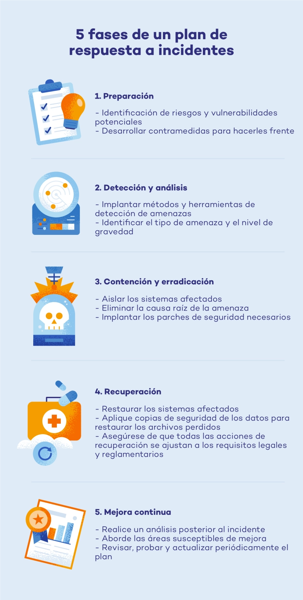

# Análisis y desarrollo

## Resumen del incidente

Esta mañana, nuestra red interna sufrió un ataque de **Denegación de Servicio (DoS)** que nos dejó inoperativos durante aproximadamente dos horas. El problema empezó cuando una avalancha masiva de paquetes **ICMP** (básicamente una "inundación de pings") saturó nuestra infraestructura, provocando que los servicios de diseño web y marketing dejaran de responder. Ni los empleados ni los procesos internos podían acceder a los recursos de la red, deteniendo por completo nuestra actividad operativa.

### Causa y origen

Luego de investigar, descubrimos que el atacante aprovechó una vulnerabilidad crítica: **un cortafuegos (firewall) que no estaba configurado correctamente**. Esta "puerta abierta" permitió que el actor malicioso enviara tráfico ICMP sin restricciones hasta colapsar el ancho de banda y la capacidad de procesamiento de nuestros equipos.

### Impacto

- **Tiempo de inactividad:** 2 horas de interrupción total.
- **Sistemas afectados:** Red interna, servicios de red compartidos y herramientas de diseño web/gráfico.
- **Consecuencias:** Pérdida de productividad inmediata y retraso en la entrega de soluciones de marketing para nuestros clientes.

### Respuesta inmediata

Nuestro equipo de gestión de incidentes actuó rápido para contener el daño. Los pasos que seguimos fueron:

1. Bloquear inmediatamente todos los paquetes ICMP entrantes en el perímetro.
2. Desconectar temporalmente los servicios no críticos para liberar recursos.
3. Priorizar y restaurar la conectividad de los servicios críticos de la organización.
Una vez que el tráfico se normalizó, se implementaron reglas de filtrado y sistemas de monitoreo para asegurar que la red volviera a un estado estable.

---

> **Reflexión:**
> Aquí debo enfatizar algo que es muy importante, entendamos que el impacto no fue solo "técnico" (paquetes **ICMP**), sino que también lo fue “de negocio” (no se podía dar servicio a las pequeñas empresas que confían en nosotros). Esto nos demuestra que, además de analisar, debemos comprender el valor del trabajo o negocio de la empresa.

---

## Marco de Ciberseguridad del Instituto Nacional de Estándares y Tecnología (NIST CSF)

[Identificar](nist-csf/01_Identificar.md) 👈

[Proteger](nist-csf/02_Proteger.md) 👈

[Detectar](nist-csf/03_Detectar.md) 👈

[Responder](nist-csf/04_Responder.md) 👈

[Recuperar](nist-csf/05_Recuperar.md) 👈

---

---

## Evaluación del proyecto: Reflexiones y notas finales

Para que esta autoevaluación sea efectiva, revisaremos si el informe cumple con los estándares de calidad que un reclutador o un **CISO** (Director de Seguridad) buscaría en mi portfolio:

### 1. Alineación con el Marco NIST CSF

- **¿Logré separar la reacción técnica de la planificación?** Sí.

    Al usar el marco, dividí claramente lo que se hace *durante* el ataque (Responder) de lo que se hace *después* para fortalecer la empresa (Proteger/Detectar).

- **Valor del aprendizaje:** Ahora entiendo que la ciberseguridad no es un evento único, sino un **ciclo continuo**.

### 2. Claridad y Objetividad

- **¿El resumen es comprensible para alguien que no es técnico?** Sí.

    El resumen en el Paso 2 evitó el drama y se centró en hechos: "2 horas de caída", "paquetes ICMP", "servicios críticos". Esa es la comunicación que genera confianza en una empresa.

### 3. Efectividad de las soluciones propuestas

- **¿Las medidas de "Protección" atacan la raíz del problema?** Sí, totalmente.

    Pasar de un firewall sin configurar a uno con **Rate Limiting** y **Anti-spoofing** cierra la puerta exacta por la que entró el atacante. No solo se puso un "parche", se mejoró significativamente la arquitectura.

---

## Reflexión final

### Lo que aprendí en este proyecto

- *El protocolo ICMP, aunque útil, puede ser un verdadero peligro si no se limita su tasa de entrada.*
- *La diferencia crítica entre **Responder** (contener el ataque) y **Recuperar** (volver a la normalidad de negocio).*
- *El marco NIST CSF no es solo una lista de tareas, es un lenguaje común que permite a todo el equipo de seguridad trabajar coordinado “bajo presión”.*

---

😉👍
